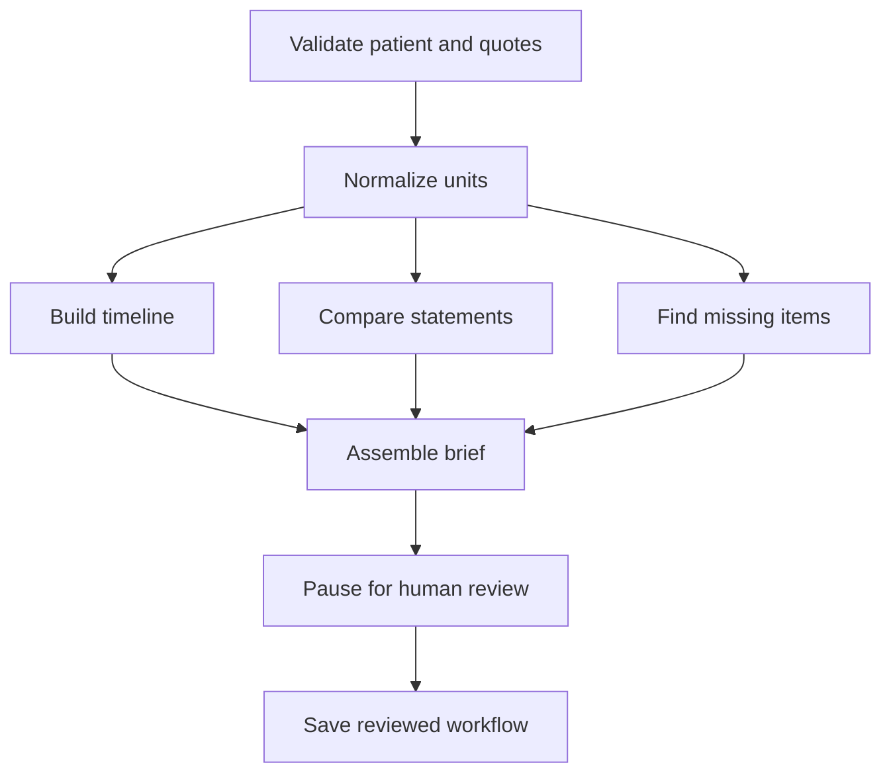

# Clinical Evidence Twin

A clear, source-linked workspace for understanding a changing set of patient records. Built with Next.js, TypeScript, LangGraph, LangChain, PostgreSQL and the MCP SDK.

**This is a synthetic-data research demo. It does not diagnose, prescribe, or recommend treatment changes. Do not upload real patient records.**

## What the product does

A clinician or reviewer often receives records from several teams. Dates can differ, a medication list may conflict with a discharge note, and important information can be missing. This workspace keeps the original text, organizes the timeline, highlights differences, and records the reviewer's reasoning.

Start with **Mira Sen**, a fictional case containing three disagreements and one missing follow-up date. **Leela Rao** demonstrates equivalent measurements in different units without creating false conflicts.

| View              | What it helps you do                                      |
| ----------------- | --------------------------------------------------------- |
| Overview          | See record coverage and the next items to check           |
| Patient timeline  | Separate event dates from dates notes were entered        |
| Source records    | Open the original text and its exact evidence quotes      |
| Needs review      | Compare both sides and save a written decision            |
| Saved memory      | Read source-linked statements and their review history    |
| Evidence workflow | Run checks, pause for a person, and resume after review   |
| Ask the evidence  | Find statements and open the sources supporting an answer |

## Start locally

Requirements: Node.js 24 LTS and npm. No paid API is needed for the evidence-search mode.

```bash
npm ci
npm run dev
```

Open `http://localhost:3000`. Local record and review changes are saved under `.data/`, which is excluded from Git. Local LangGraph checkpoints are in memory: restarting the process loses active workflow checkpoints, but source records and review notes remain. Start a new workflow after a local restart.

For a production build (saving requires a strong `SESSION_SECRET`; without it the app stays read-only):

```bash
npm run build
npm start
```

For tests:

```bash
npm test
npm run typecheck
```

## A five-minute demo

1. Choose Mira Sen and open **Needs review**.
2. Open each source chip in the allergy-history disagreement. Compare the exact source text.
3. Choose **Keep it open**, explain what you need, and save the note.
4. Ask **Which records disagree?** The answer includes the competing sources.
5. Open **Evidence workflow**, run the checks, and review the brief. The actual LangGraph execution pauses at a human-review interrupt.
6. Add the built-in sample JSON record to supply a fictional follow-up date. The missing-item check updates. Earlier workflow runs remain tied to their original source set.
7. Export a readable Markdown brief or a complete JSON bundle.

## How the graph works



This is a real LangGraph `StateGraph`, with parallel branches, a join, a typed interrupt response, thread-scoped checkpoints, and `Command({ resume })`. A second graph handles questions: scope check → retrieval → optional LangChain synthesis → citation validation.

## AI mode is explicit

Without a model connection, answers use deterministic evidence retrieval. The UI labels them **Evidence search**. It never pretends a model is running.

Optional AI summaries use LangChain with Gemini or an OpenAI-compatible Vercel AI Gateway endpoint. Set `AI_ENABLED=true`, a supported `AI_MODEL`, and the appropriate server credential. Outputs must cite known sources; if a conflict's competing source is omitted, the app falls back to original evidence. AI output is never promoted into patient memory automatically. This is a useful structural guardrail, not a guarantee that every generated sentence is accurate.

The demo limits question frequency per workspace and bounds model output. Before any public AI-enabled launch, add shared infrastructure-level abuse controls and provider spending limits. Anonymous browser sessions are not suitable for real clinical users.

## Durable deployment

See [Deployment](docs/DEPLOYMENT.md). On Vercel, writes require both `DATABASE_URL` and `SESSION_SECRET`. PostgreSQL stores workspace records and LangGraph checkpoints. Run the migration before enabling the deployed app.

Without a database, Vercel serves a clearly labeled read-only preview. No durable save is claimed in that mode. An absent model connection leaves evidence search available when the database is configured.

## MCP

Five read-only tools are implemented: `list_synthetic_cases`, `get_evidence_timeline`, `search_evidence`, `list_review_items`, and `read_source`.

```bash
npm run mcp
```

The stdio server uses the original synthetic examples unless `MCP_WORKSPACE_ID` is explicitly configured. The hosted `/api/mcp` route requires `Authorization: Bearer <MCP_ACCESS_TOKEN>`. No tools edit sources, prescribe, or make clinical decisions. See [MCP setup](docs/MCP.md).

## Engineering choices and limits

- Match exact patient IDs. No fuzzy patient matching.
- Compare values only when the structured key and event context match.
- Keep every original statement. A newer note is not automatically more trustworthy.
- Convert only grams → kilograms and metres → centimetres. Unsupported units remain untouched.
- Preserve event dates and source-entry dates separately.
- Validate imported JSON and require every evidence quote to exist verbatim in the supplied text.
- Reviewer selection records a preference; it does not establish verified clinical truth.
- Use a signed, HttpOnly, SameSite session cookie to isolate anonymous demo workspaces.
- Use revision checks and a row lock to prevent accidental overwrites from stale browser tabs.
- Keep original source text out of routine server logs. No analytics SDK is added.
- Imports support structured synthetic JSON. OCR, arbitrary PDF extraction, FHIR/EHR integrations, terminology services and external clinical-reference retrieval are not implemented.
- PostgreSQL migrations and hosted AI require actual service configuration and separate verification. This repository does not claim regulatory certification or production clinical readiness.

More detail: [Architecture](docs/ARCHITECTURE.md), [Safety and evaluation](docs/SAFETY.md), [Verification](docs/VERIFICATION.md).
